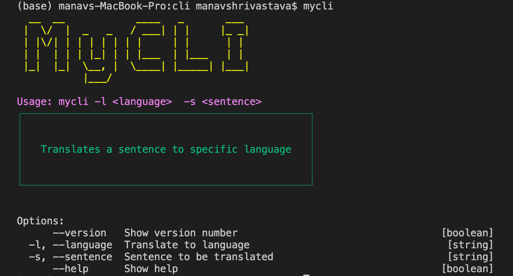
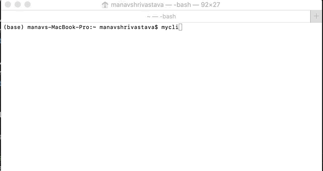

<p align="center">
  
 </p>
 <p align="center">
   
 
   
   
  
 </p>
 <br>
<p align="center">A Sample CLI tool to translate language in the terminal.</p>
<br>

<p align="center">
  
</p>


---

## Usage

```
~$ mycli --help
  __  __            ____   _       ___ 
 |  \/  |  _   _   / ___| | |     |_ _|
 | |\/| | | | | | | |     | |      | | 
 | |  | | | |_| | | |___  | |___   | | 
 |_|  |_|  \__, |  \____| |_____| |___|
           |___/                       

Usage: mycli -l <language>  -s <sentence>
┌────────────────────────────────────────────────┐
│                                                │
│                                                │
│   Translates a sentence to specific language   │
│                                                │
│                                                │
└────────────────────────────────────────────────┘


Options:
      --version   Show version number                                  [boolean]
  -l, --language  Translate to language                                 [string]
  -s, --sentence  Sentence to be translated                             [string]
      --help      Show help                                            [boolean]

```

> :warning: **You can also use the ISO-639-1 code of the language instead of writing the full language name**

<br>

## Installation

1. Clone the repository and then navigate to it.
2. Run ```npm install``` to install the dependencies.
3. Run ```npm install -g .``` to install the CLI. <br>

> :warning: **This might cause an error** which can be resolved easily by using ```sudo``` with the command, **however**, using ```sudo``` with ```npm``` is **not recommended** because it might cause permission issues later. So instead put the code below in your .bashrc file and then run the above command again.
```
npm set prefix ~/.npm
PATH="$HOME/.npm/bin:$PATH"
PATH="./node_modules/.bin:$PATH"
```
4. Now you are good to go and can use the CLI globally!

Type ```mycli``` or ```mycli --help``` to get started.

<br>

## License

MIT © ***MyCLI***